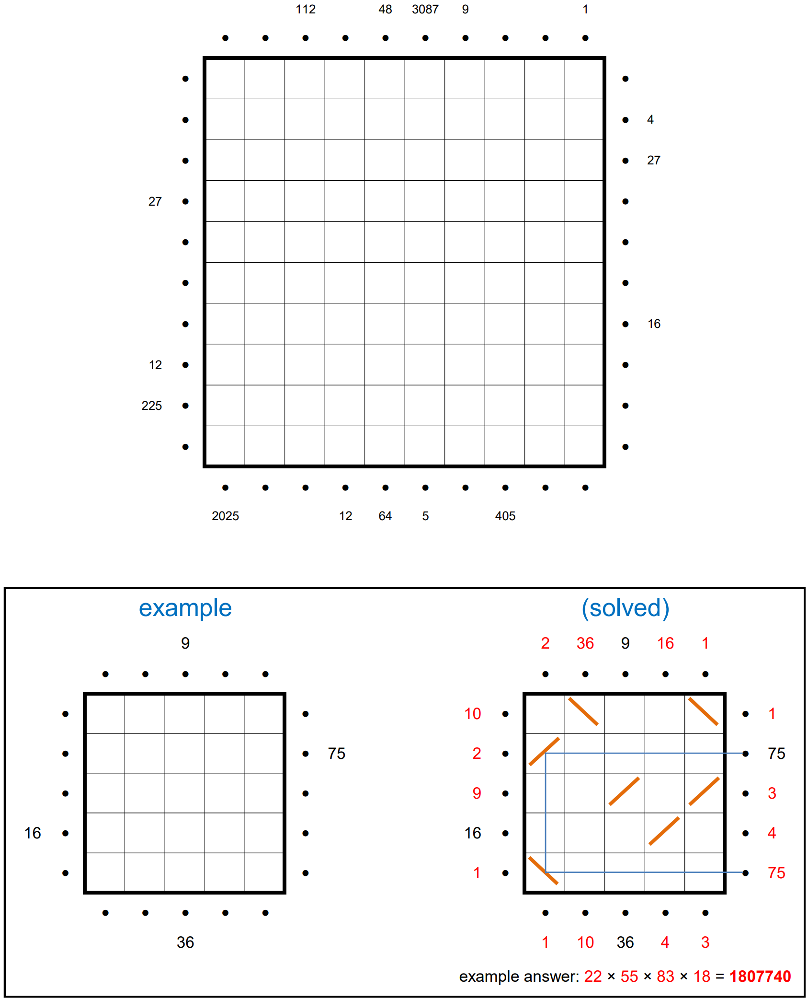
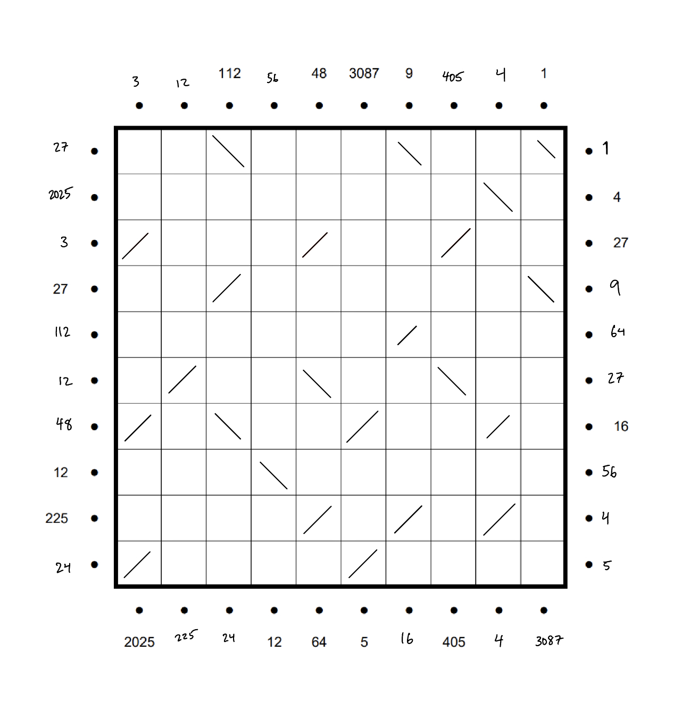

# Jane Street Puzzles - March 2025: Hall of Mirrors 3

## Description:

The perimeter of a 10-by-10 square field is surrounded by lasers pointing into the field. (Each laser begins half a unit from the edge of the field, as indicated by the •’s.)

Some of the lasers have numbers beside them. Place diagonal mirrors in some of the cells so that the product of the segment lengths of a laser’s path matches the clue numbers. (For instance, the segments for the “75” path in the example puzzle have lengths 5, 3, 5.) Mirrors may not be placed in orthogonally adjacent cells.

Once finished, determine the missing clue numbers for the perimeter, and calculate the sum of these clues for each side of the square. The answer to this puzzle is the product of these four sums.

# Approach:

My first thought was to actually try to find a code-based solution to this month's problem. With such a large number of possibilities for side lengths, it was appealing to try to have a computer do the thinking. While trying to solve the puzzle yourself to find a better heuristic for the computer to solve the problem than just random backtracking, you recognized that the problem was actually doable by hand.

Began the manual solution by taking the prime factorization of each given number and blindly going from there. In doing this, you found that some numbers were harder to make work with the rest, namely the numbers with larger prime factors (3087 being the biggest offender of this with the factorization 3^2 \* 7^3). Once you found a nice path for 3087, you were able to sort of just fill in the blanks, picking the low-hanging fruit, e.g. the 1 and 4 in the top right, which helped you decide what the paths of the other numbers would need to look like.

In the end, you came up with the following board:

The answer to this month's problem was the product of the sums of each side. In left, top, right, bottom order, this was: 2251 \* 480 \* 165 \* 3356 = **598304995200**.

## Learnings:

- Some problems should not be solved with code!
- Stepping away really helps you escape tunnel vision. For the longest time, finding the path for 225 was extremely difficult. Had all the rest of the segments (feasibly) done, but couldn't figure that one out. It took you about 2 minutes when looking at this problem for the last time.
